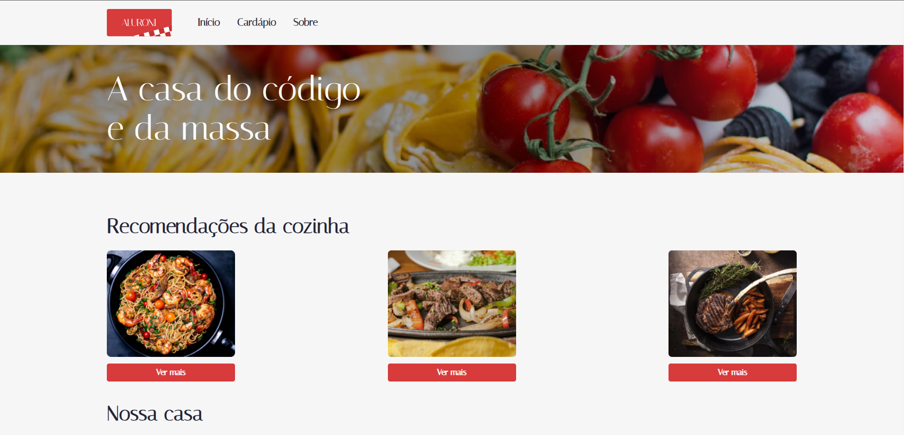
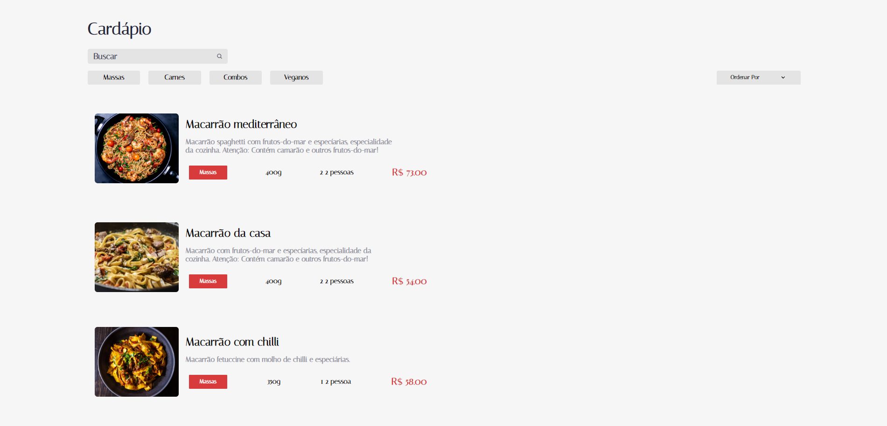
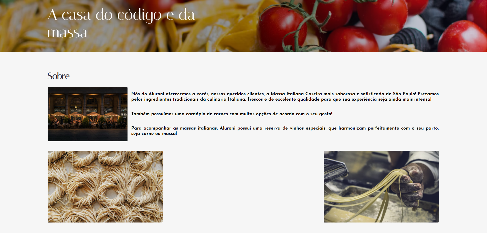

# Projeto Aluroni Performance

Projeto desenvolvido durante o curso de React: Otimizando a performance

# Principais tecnologias utilizadas no projeto
* React
* TypeScript
* NodeJS
* Scss

# Imagens do projeto

Pagina inicial do projeto

Pagina que contém o cardápio

Pagina que contém a explicação sobre a empresa
